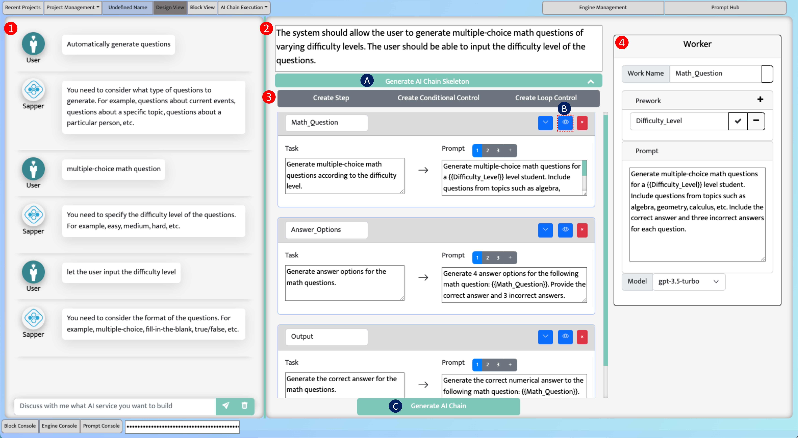
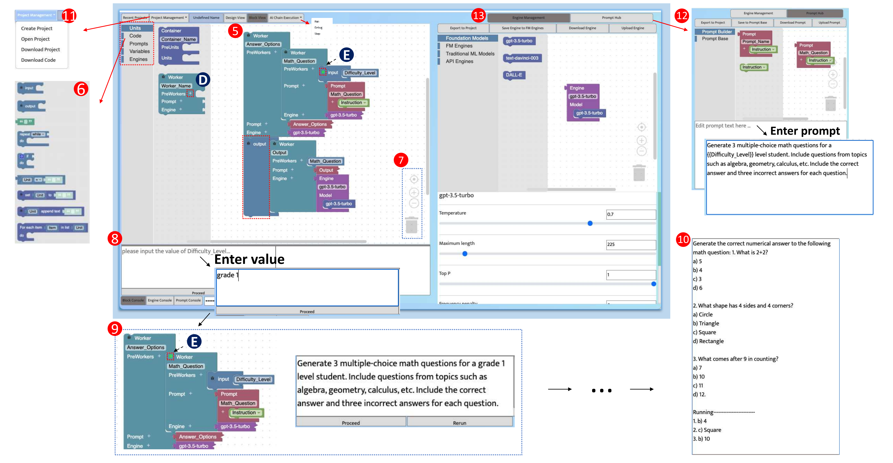
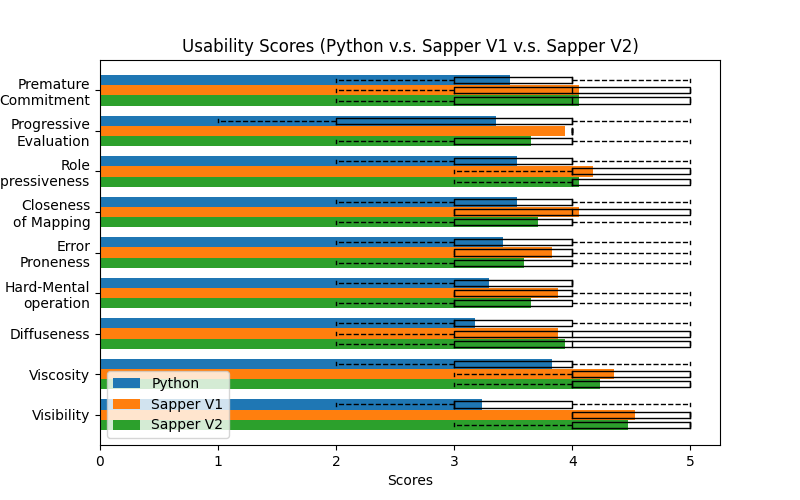
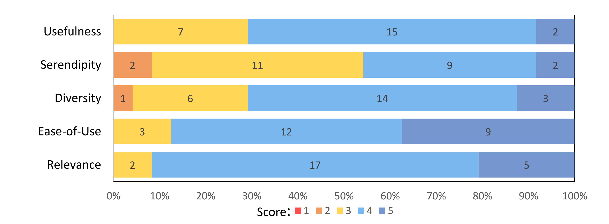
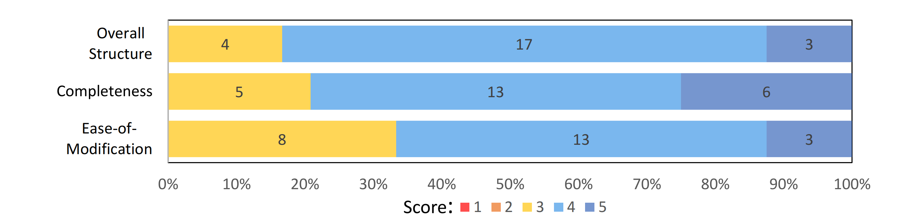

# Prompt Sapper: A LLM-Empowered Production Tool for Building AI Chains

## RESOURCE
- Paper: [arXiv](https://arxiv.org/abs/2306.12028), [ACM](https://dl.acm.org/doi/10.1145/3638247)

- Video: [Youtube](https://youtu.be/Op4Eh11Hf3A?si=MGC9JWZvYX0rBgLD)

- Code: [Sapper IDE Code](./sapperIDE)

- User Study 1: [User study for Sapper](./user%20study1)

- User Study 2:  [User study on the effectiveness of copilot](./user%20study2)

## INTRODUCTION
The emergence of foundation models, such as large language models (LLMs) GPT-4 and text-to-image models DALL-E, has opened up numerous possibilities across various domains. 
People can now use natural language (i.e., prompts) to communicate with AI to perform tasks. 
While people can use foundation models through chatbots (e.g., ChatGPT), chat, regardless of the capabilities of the underlying models, 
is not a production tool for building reusable AI services. 

APIs like LangChain allow for LLM-based application development but require substantial programming knowledge, thus posing a barrier. 
<b>To mitigate this, we systematically review, summarise, refine and extend the concept of AI chain by incorporating the best principles and practices that 
have been accumulated in software engineering for decades into AI chain engineering, to systematize AI chain engineering methodology.</b>

We also develop a no-code integrated development environment, Prompt Sapper, which embodies these AI chain engineering principles and 
patterns naturally in the process of building AI chains, thereby improving the performance and quality of AI chains. 

With Prompt Sapper, AI chain engineers can compose prompt-based AI services on top of foundation models through chat-based requirement analysis and visual programming. 
Our user study evaluated and demonstrated the efficiency and correctness of Prompt Sapper
## AI Chain Methodology and IDE Requirements

### Concepts of AI Chain

- **AI Chain Requirements**: Rapid prototyping to build custom AI services on foundation models, focusing on solving problems using AI rather than data engineering and model training.
- **Worker Composition and Cooperation**: An AI chain consists of cooperating function units (workers), organized hierarchically to execute tasks.
- **Worker Roles and Prompts**: Prompts define worker functions. Decomposing complex tasks into simpler sub-tasks reduces prompt design difficulty.

### Magic Enhancing Magic

Leveraging LLMs to enhance AI chain engineering:

- **Requirement Elicitation**: Interacting with engineers to clarify vague requirements into specific AI chain needs.
- **Mechanical Sympathy**: Understanding AI model behaviors to improve prompt design and task decomposition.

### AI Chain System Design

- **Requirement Analysis**: Clarifying and refining initial AI chain requirements through interaction with LLMs.
- **Task Decomposition**: Breaking down complex tasks into manageable sub-tasks, creating a hierarchy of tasks accomplished by AI chain workers.
- **Workflow Walk-Through**: Developing step-by-step processes for solving problems and ensuring worker cooperation through defined function signatures.

### AI Chain Implementation

Prompts should adhere to Grice’s maxims of conversation: informative, truthful, relevant, and clear, focusing on essential elements and removing unnecessary details.

### AI Chain Testing

Testing involves running AI chains, evaluating results, and debugging behaviors:

- **Unit Tests**: Testing individual workers.
- **Integration Tests**: Testing cooperating workers.
- **System Tests**: Testing the entire AI chain.


## PROMPT SAPPER: AI CHAIN IDE
Unlike traditional IDEs focused on code development, Prompt Sapper is designed to be user-friendly for people with little or no computing knowledge. This is reflected in three key principles:

1. **Seamless Integration of Methodology**: Promptmanship (AI chain methodology) is seamlessly integrated into the IDE, utilizing best practices in AI chain development.
2. **Intelligent Co-Pilots**: Leveraging the extensive knowledge and conversational capabilities of LLMs to assist non-technical professionals in task modeling, requirement analysis, design, and construction.
3. **No-Code Development**: Supporting the entire process of AI chain development without coding, using block-style visual programming for implementation, execution, and testing, and providing one-click deployment for easy user access.

(1) **Figure 1: Design View** - This figure shows the design view where users consult the co-pilot to elicit requirements, which are summarized and refined. Users can generate and modify the skeleton, adjust inputs, prompts, and models, and finally generate the block code in the Block View.



(2) **Figure 2: Block View and Artifact Management** - This figure shows the Block View and artifact management, where users can implement, execute, and test their AI chains using visual programming.




## User Study

### Design of Formative Study

Our Sapper platform aims to reduce barriers to developing and utilizing state-of-the-art deep learning and LLMs by offering a block-based visual programming technique and embedding a systematic prompting engineering methodology. This study compared the effectiveness of Sapper V2 with Python (a native programming tool) and an ablation version of our tool (Sapper V1 - Block View Only). The objectives were to evaluate the ease of use and the learning curve associated with Sapper.

### Procedure

We recruited 18 participants aged 18–25 years, with varying levels of programming experience. Each participant used three tools (Python, Sapper V2, and Sapper V1) to complete programming tasks in a counterbalanced order. A training session was provided to introduce Sapper with Design View, and participants practiced warm-up tasks using both Sapper and Python.

Participants completed three sets of tasks (Task A/B/C) with similar difficulties using all three tools. Tasks involved programming constructs such as plain use of LLM, if-else, while loop, variables, and the use of different LLMs. After completing the tasks, participants filled out a questionnaire regarding user experience and cognitive dimensions for interface evaluation.

### Results


1. **Sapper V2 vs. Python**: 
   - **Ease of Use**: Sapper V2 was easier to understand and use compared to Python. Participants spent significantly less time completing tasks using Sapper V2.
   - **Error-Prone Nature**: Python was more error-prone, with participants making simple grammar errors, while Sapper V2 encapsulated complex API calls within a simple interface.
   - **Usefulness Scores**: Sapper V2 outperformed Python in usability metrics, particularly in diffuseness and visibility.

2. **Sapper V1 vs. Sapper V2**:
   - **Correctness and Time Spent**: No significant difference was found between Sapper V1 and Sapper V2 in terms of correctness and time spent.
   - **Usability Scores**: Both versions had similar user experience, with Sapper V2 being more concise and having higher visibility.

### Detailed Time Spent

|          | Python            | Sapper V1          | Sapper V2          |
|----------|-------------------|--------------------|--------------------|
| Task 1   | 475.27 (228.58)   | 211.33 (76.54)     | **155.72 (49.65)** |
| Task 2   | 574.50 (315.35)   | **485.72 (178.33)**| 529.94 (214.53)    |
| Task 3   | 508.55 (195.43)   | 382.05 (144.18)    | **359.77 (130.30)**|
| Task 4   | 807.66 (337.61)   | 672.11 (338.02)    | **644.11 (354.02)**|
| **ALL**  | 2,366.00 (536.70) | **1,751.00 (493.34)**| **1,689.00 (447.49)**|

**Table 1:** Detailed time spent (seconds) for each task.

## User Study on the Effectiveness of Co-Pilots

### Procedure

We recruited 12 participants aged 18–25 years, all university students with varying levels of development experience. Participants were trained on the basic operations and interface of Sapper IDE, as well as background knowledge on requirement elicitation and AI chain skeleton generation.

1. **Requirement Elicitation Co-Pilot**: Participants used the co-pilot to clarify task requirements within 10 minutes, followed by another 10-minute period to clarify self-conceived tasks. Participants rated the co-pilot on usefulness, serendipity, diversity, ease-of-use, and relevance using a 5-point Likert scale.
   
2. **AI Chain Skeleton Generation Co-Pilot**: Participants used the co-pilot to generate and run AI chain skeletons based on previously elicited requirements. They rated the co-pilot on the overall structure, completeness of content, and ease of modification using a 5-point Likert scale.

### Results

1. **Requirement Elicitation Co-Pilot**:
   - Participants performed 134 rounds of clarification sessions across 24 tasks.
   - Ratings for usefulness, serendipity, diversity, ease-of-use, and relevance were all ≥3.5 on average.
   - The co-pilot effectively helped clarify and deepen participants' thoughts, providing diverse, unexpected, and relevant suggestions.

2. **AI Chain Skeleton Generation Co-Pilot**:
   - Ratings for the overall structure, completeness of content, and ease of modification were all ≥3.
   - 18 out of 24 generated AI chain skeletons were directly executable, with minor modifications needed for the remaining six.
   - Participants found the skeletons helpful in facilitating their development efforts.

### Usability Scores

<br/>
Usability scores for requirement elicitation Co-pilot.
<br/>
<br/>
Usability scores for AI chain skeleton generation Co-pilot.

### User Study Links

- [User Study 1: User study for Sapper](https://github.com/YuCheng1106/PromptSapper/tree/main/user%20study1)
- [User Study 2: User study on the effectiveness of copilot](https://github.com/YuCheng1106/PromptSapper/tree/main/user%20study2)


## Citation

```bibtex
@article{10.1145/3638247,
author = {Cheng, Yu and Chen, Jieshan and Huang, Qing and Xing, Zhenchang and Xu, Xiwei and Lu, Qinghua},
title = {Prompt Sapper: A LLM-Empowered Production Tool for Building AI Chains},
year = {2024},
issue_date = {June 2024},
publisher = {Association for Computing Machinery},
address = {New York, NY, USA},
volume = {33},
number = {5},
issn = {1049-331X},
url = {https://doi.org/10.1145/3638247},
doi = {10.1145/3638247},
journal = {ACM Trans. Softw. Eng. Methodol.},
month = {jun},
articleno = {124},
numpages = {24},
keywords = {AI chain engineering, visual programming, large language models, No/Low code, SE for AI}
}
